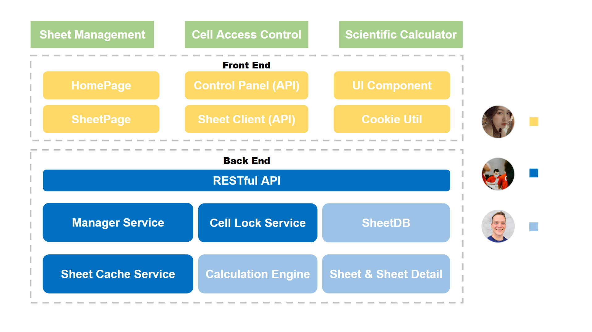
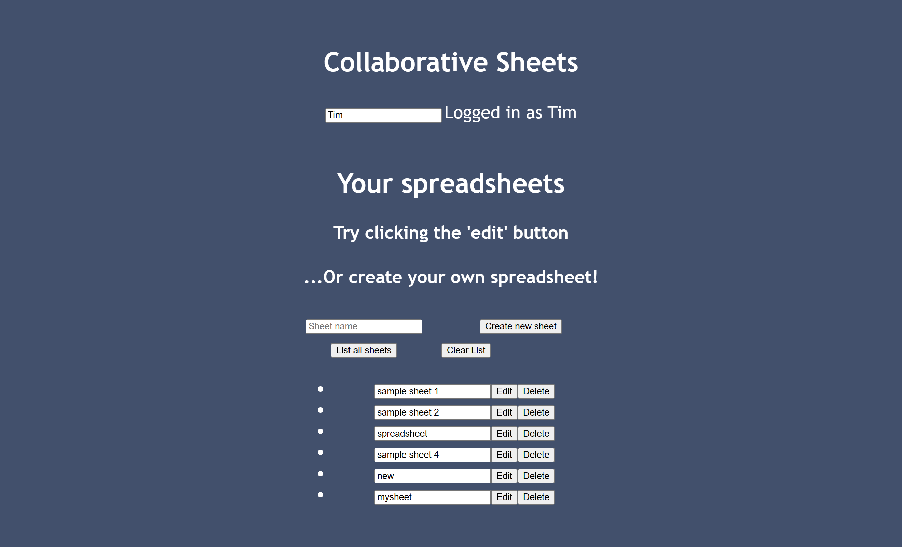
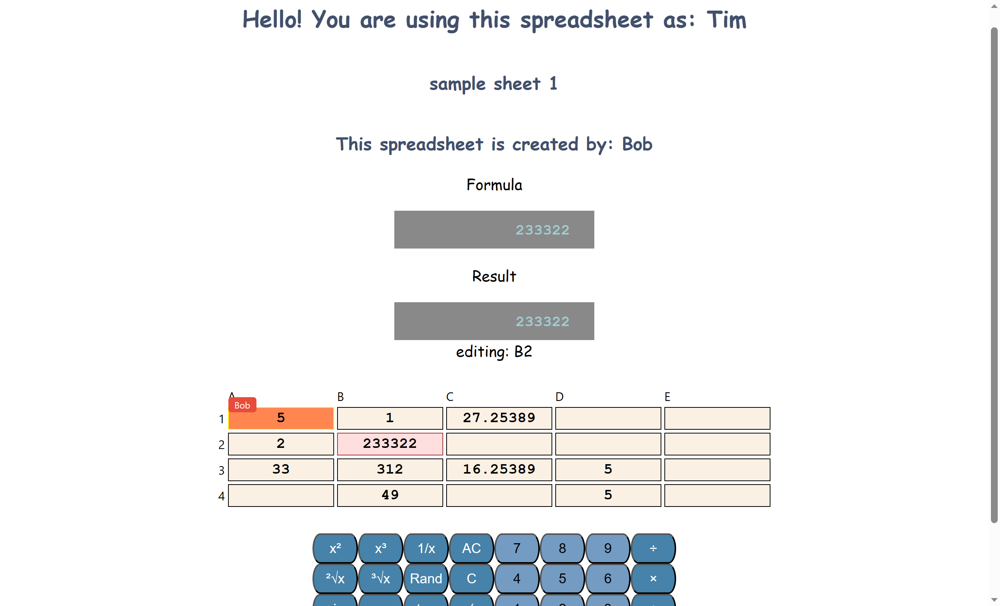
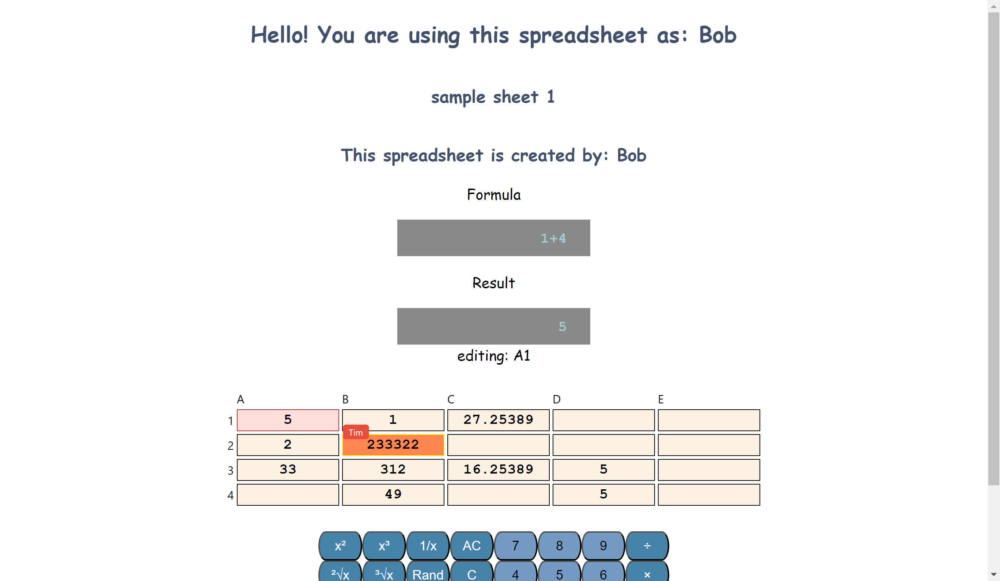

# CS 5500 - Foundations of Software Engineering

Northeastern University

August 15, 2023

Anbang Zhang, Siyi Ling, Greg Howard

## Introduction
OH SHEET! is a lightweight, online spreadsheet tool, purpose-built for collaborative classroom environments. Drawing upon axiomatic calculator functionality, OH SHEET! provides one comprehensive surface for mathematics, economics, and accounting teachers to instruct their students in spreadsheet-based math. Devoid of text processing, the tool avoids problematic note-passing between peskier students. And, teachers in other subjects may still benefit from using OH SHEET! to calculate and share grades.
See Figure I in the appendix for a visual representation.
## Architecture
Our implementation is built in TypeScript with Node.js and React.

Data storage takes place locally on the deployment server, with standard CRUD operations, and uses minimal space by only storing formulae, rather than all possible values and errors. Calculations are handled with a recursive descent parser and can manage many scientific functions, in addition to standard arithmetic. Note: the current version is meant to be sufficient for the middle school market, and the app is extensible, such that new functions can be developed for new verticals. Greg built out the data storage and calculation engine, so new feature requests for these modules can be directed to him.

Calculation requests are managed by a middle layer, behind a RESTful API. To minimize processing times, sheet caches are maintained for already computed outputs. And, to provide for seamless collaboration, cells that are already being edited by one user are locked and uneditable by other users until the original user completes their edit. Anbang built out these services and can be contacted for discussion of new collaboration functionality.

Clients see components rendered for each portion of a spreadsheet and for management of spreadsheet directories. To harmoniously communicate with the backend, the frontend translates clicks and keyboard entries into tokens and API calls. In addition to rendering components and shuttling tokens, the spreadsheet is able to dynamically render the user name from the login page, and remember the last cell a user accessed and render it as selected upon next loading into the same sheet. Siyi designed and programmed the frontend, so new requests for these portions of the application can be directed to her.

See *Architecture* in the appendix for an architectural schema.
## Future work
With more time and budget, we would
- Deploy to EC2 for easily resizable compute
- Configure an external database to decouple storage infrastructure from the server
- Add new functions to enable market expansion
- Refine our design to improve the look and feel of OH SHEET!
- Add color-blind and dark mode and color palette customization
- Enable smart warning messages

Please contact our PM Juancho Buchanan with any interest. Thank you for your time and consideration.

# Appendix

Architecture:

Home page:

Sheet page I:

Sheet page II:
